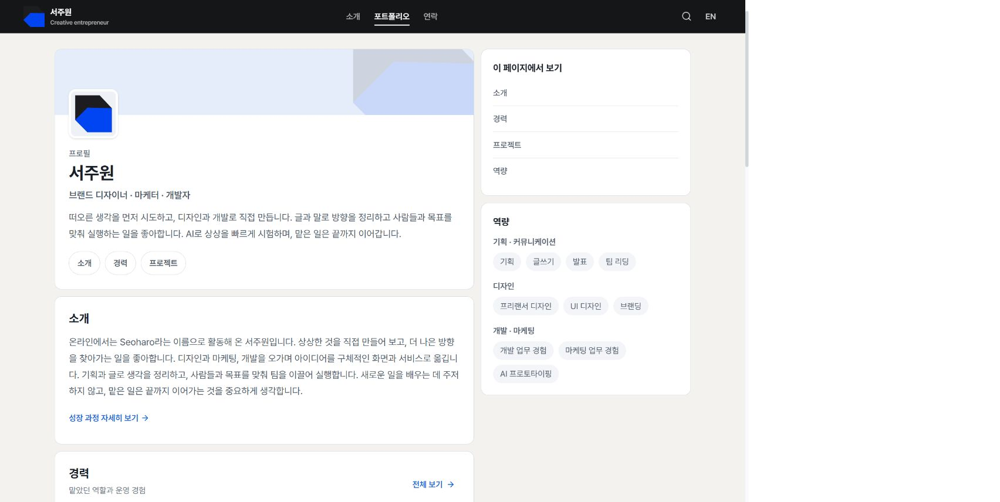
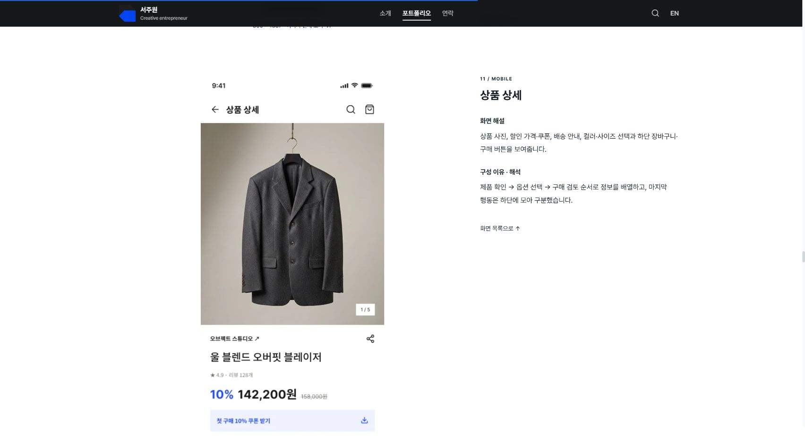

# 서주원 | Brand Designer • Marketer • Developer

Seoharo라는 이름으로 활동해 온 서주원의 소개, 작업과 경력, 협업 연락처를 정리한 포트폴리오입니다.

[사이트](https://seoharo.kro.kr/) · [소스](https://github.com/haroseo/Seoharo)



## 화면과 디자인

소개·연락은 기존 사이트의 어두운 2열 구성을 유지하고, 포트폴리오는 밝은 프로필 중심의 레이아웃을 사용합니다. Pretendard 고딕과 절제된 강조색, 읽기 쉬운 정보 위계를 기준으로 합니다. LinkedIn의 정보 구조를 참고했으며 LinkedIn과 제휴한 서비스는 아닙니다.

- 소개: 개인 소개, 역량, 스크롤에 따라 읽는 성장 여정.
- 포트폴리오: 프로필, 경력 전체 보기, 분야·진행 상태별 작업 기록.
- 상세: 디자인그래피(진행 중), 1 to Z, Planor, Design Pick, 나랏말싸미 및 확인된 경력.
- 연락: 승인된 Email, GitHub, LinkedIn.
- 사이트 전체 검색: 한·영 이름, 초성 및 한/영 키보드 입력 실수 대응.

1 to Z는 Figma에서 가져온 웹 5개·모바일 13개 화면을, 디자인그래피는 공유된 Claude 프로토타입의 주요 화면 12개를 보여줍니다. 화면별 해설과 구성 이유(해석), 웹·모바일 목차, 전체 이미지 보기 및 세부 화면 검색을 지원합니다. 긴 화면도 잘라내지 않으며 이미지는 로컬 WebP로 제공하고 지연 로딩합니다. 예시 상품·주문·회원 정보나 아카이브 수치를 실제 운영 성과로 주장하지 않습니다. 디자인그래피 원본의 준비 중 영역도 구분하며 외부 링크에는 로그인이 필요할 수 있습니다. 나머지 프로젝트 커버는 소개용 작업물입니다.



## 개발

React 19 · TypeScript · Vite 8. 한국어와 영문 모두 Pretendard Variable 및 시스템 폰트 폴백을 사용합니다. 백엔드나 API 키가 필요 없는 정적 사이트입니다.

Node.js 24에서 검증했습니다. 테스트는 Node의 기본 테스트 실행기와 TypeScript 타입 제거를 사용합니다.

```bash
npm ci
npm run dev
```

```bash
npm run lint
npm test
npm run build
npm run preview
```

작업 데이터는 `src/data/portfolioContent.ts`, 디자인 화면과 해설은 `src/data/designCaseStudies.ts`, 화면은 `src/components/portfolio/`, 디자인 토큰과 레이아웃은 `src/portfolio.css`에서 관리합니다. 선택적 이미지 준비 스크립트 `scripts/prepare-design-assets.mjs`에는 비공개 원본 입력과 sharp가 필요하며, 일반 실행·빌드에는 필요하지 않습니다.

키보드 포커스, 본문 바로가기, 모바일 메뉴 Escape, reduced-motion CSS, 이미지 오류 폴백, 검색 빈 상태, 저장소 사용 제한 시 언어 전환을 지원합니다.

## GitHub Pages

기존 사용자 지정 도메인과 CNAME을 유지합니다. 빌드 시 실제 React App을 한국어 HTML로 미리 렌더링하고 클라이언트가 같은 화면에 연결됩니다. 13개 대표 페이지와 12개 호환 주소를 직접 열 수 있으며, 없는 페이지는 자동 홈 이동 대신 noindex 404를 제공합니다. 서버 렌더링 임시 번들은 `dist-ssr`, 공개 파일은 `dist`로 분리합니다.

`build:verify`는 본문·메타정보·구조화 데이터·사이트맵·연락 링크·이미지·비공개 파일 유출 여부를 검사합니다. GitHub 빌드 성공, 실제 Pages 배포, 도메인 DNS/HTTPS, 검색엔진 색인 상태는 각각 따로 확인해야 합니다. 사이트맵 제출이나 키워드 추가로 상위 노출을 보장하지 않습니다.

## 정보와 연락

확인되지 않은 성과·날짜·기술 스택, 현재 CEO 직함, 비활성 Discord 채널은 표시하지 않습니다. 학교명·학년·나이·거주지 등은 공개하지 않습니다.

이름·활동명·세 연락 채널은 소유자가 공개를 승인한 정보입니다. 검색어를 서버로 전송하지 않으며 분석 서비스나 방문자 추적 스크립트를 추가하지 않습니다. 서체는 jsDelivr CDN에서 불러오며 실패 시 시스템 고딕으로 대체합니다. 외부 프로젝트의 운영 상태는 달라질 수 있습니다.

로컬 협업 맥락과 검수 문서는 공개 배포 대상이 아닙니다. 환경 파일과 자격증명을 커밋하지 않습니다. 기존 LICENSE를 따르며 개인·회사 로고의 상표권까지 부여하는 것은 아닙니다.
